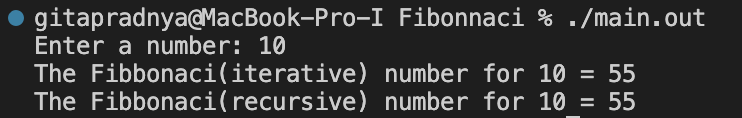
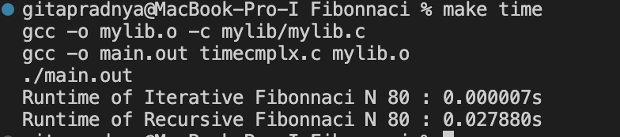
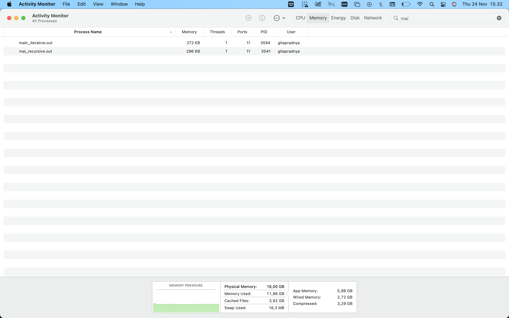

# Fibonacci

Here, i will compare the time and space complexity of fibonacci(iterative) and fibonacci(recursive)

## Fibonacci iterative

```c
int FibIterative(int N){
 int first = 0, second = 1, result, i;
    for (int i = 0; i < N+1; i++)
  {
    if (i <= 1){
        result = i;
    }
    else
    {
      result = first + second;
      first = second;
      second = result;
    }
}
return result;
}
```

## Fibonacci recursive

```c
int FibRecursion(int N){
   if (N==0){
        return 0;
    }
    else if (N==1){
        return 1;
    }
    else{
        return FibRecursion(N-1)+FibRecursion(N-2);
    }

}
```

# Testing

## How to run

Using command make; ./main.out

```bash
make; ./main.out
```

## Result



# Benchmark

Benchmarking is to test of code and help us improve our code by comparing each approach's time and space complexity.

# Time Complexity

## How to run

using command make time

```bash
make time
```

## Time Comparison

In this case i use N = 80

It shows that the time taken for iterative N = 80 is 0.0000007s and for recursive N = 80 us 0.027880s

# Space Complexity

## How to run

```bash
make space
./mai_recursive.out
```

```bash
make space
./main_iterative.out
```

## Space Comparison

(using activity monitor)

N = 1000

It shows that memory usage by iterative is 272kb and memory usage by recursive is 296kb

N = 10000

It shows that memory usage by iterative is 272kb and memory usage by recursive is 720kb
